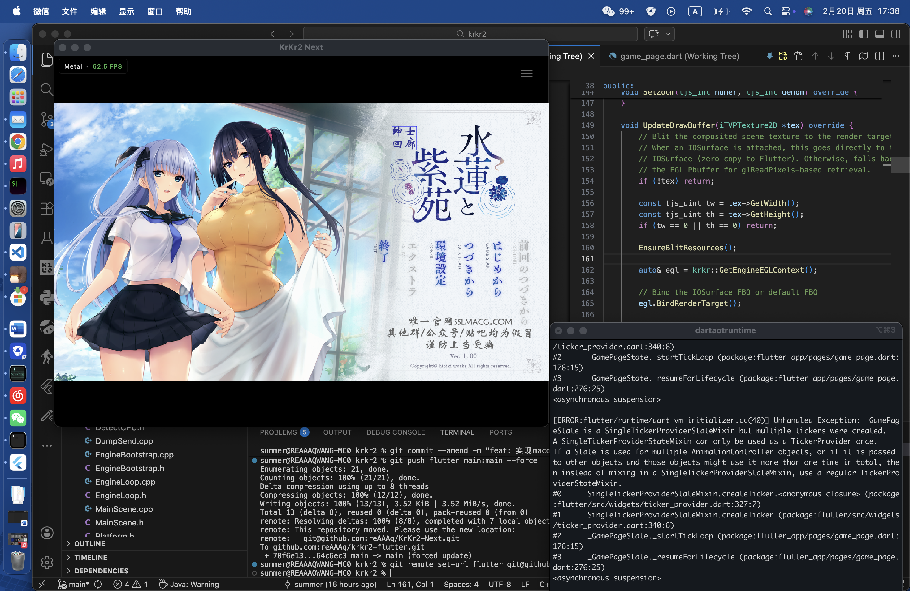

  <h1 align="center">KrKr2 Next</h1>
  
基于 Flutter 重构的下一代 KiriKiri2 跨平台模拟器

  
  
  
  
  

---

**语言 / Language**: 中文 | [English](README_EN.md)

> 🙏 本项目基于 [krkr2](https://github.com/2468785842/krkr2) 重构，感谢原作者的贡献。

## 简介

**KrKr2 Next** 是 [KiriKiri2 (吉里吉里2)](https://zh.wikipedia.org/wiki/%E5%90%89%E9%87%8C%E5%90%89%E9%87%8C2) 视觉小说引擎的现代化跨平台运行环境。它完全兼容原版游戏脚本，使用现代图形接口进行硬件加速渲染，并在渲染性能和脚本执行效率上做了大量优化。基于 Flutter 构建统一的跨平台界面，支持 macOS · iOS · Windows · Linux · Android 五大平台。

下图为当前在 macOS 上通过 Metal 后端运行的实际效果：

  

## 架构

  

**渲染管线**：引擎通过 ANGLE 的 EGL Pbuffer Surface 进行离屏渲染（OpenGL ES 2.0），渲染结果通过平台原生纹理共享机制（macOS → IOSurface、Windows → D3D11 Texture、Linux → DMA-BUF）零拷贝传递给 Flutter Texture Widget 显示。

## 开发进度

> ⚠️ 本项目处于活跃开发阶段，尚未发布稳定版本。macOS 平台进度领先。

| 模块 | 状态 | 说明 |
|------|------|------|
| C++ 引擎核心编译 | ✅ 完成 | KiriKiri2 核心引擎全平台可编译 |
| ANGLE 渲染层迁移 | ✅ 基本完成 | 替代原 Cocos2d-x + GLFW 渲染管线，使用 EGL/GLES 离屏渲染 |
| engine_api 桥接层 | ✅ 完成 | 导出 `engine_create` / `engine_tick` / `engine_destroy` 等 C API |
| Flutter Plugin | ✅ 基本完成 | Platform Channel 通信、Texture 纹理桥接 |
| Texture 零拷贝渲染 | ✅ 基本完成 | 通过平台原生纹理共享机制零拷贝传递引擎渲染帧到 Flutter |
| Flutter 调试 UI | ✅ 基本完成 | FPS 控制、引擎生命周期管理、渲染状态监控 |
| 输入事件转发 | ✅ 基本完成 | 鼠标 / 触控事件坐标映射转发到引擎 |
| 引擎性能优化 | 🔨 进行中 | SIMD 像素混合、GPU 合成管线、VM 解释器优化等 |
| 游戏兼容性优化 | 🔨 进行中 | KAGParser / kagparserex / motionplayer 插件已完成；持续补全 layerEx 系插件与脚本边界情况 |
| 原有 krkr2 模拟器功能移植 | 📋 规划中 | 将原有 krkr2 模拟器功能逐步移植到新架构 |

## 平台支持状态

| 平台 | 状态 | 图形后端 | 纹理共享机制 |
|------|------|----------|-------------|
| macOS | ✅ 基本完成 | Metal | IOSurface |
| iOS | 🔨 流程打通，正在优化和修复 OpenGL 渲染 | Metal | IOSurface |
| Windows | 🔨 基本流程打通，部分 UI 功能待完善 | Direct3D 11 | D3D11 Texture |
| Linux | 🔨 基本流程打通，输入对话框等待实现 | Vulkan / Desktop GL | DMA-BUF |
| Android | 🔨 流程跑通，优化中 | OpenGL ES / Vulkan | HardwareBuffer |

## 引擎性能优化

| 优先级 | 任务 | 状态 |
|--------|------|------|
| P0 | 像素混合 SIMD 化 ([Highway](https://github.com/google/highway)) | ✅ 完成 |
| P0 | 全 GPU 合成渲染管线 | 🔨 进行中 |
| P0 | TJS2 VM 解释器优化 (computed goto) | ✅ 完成 |

## 近期小更新 / Recent Updates

- **TJS2 VM 解释器 computed goto 优化**：在 GCC/Clang 平台上使用直接线程化分派（labels-as-values）替代传统 switch-case，消除中央分支瓶颈，每个操作码拥有独立的间接跳转，CPU 分支预测器可以学习逐操作码的跳转模式，预计提升 15-25% 脚本执行性能。MSVC 自动回退到原 switch-case 路径，零兼容性风险。同步修复：越界操作码安全保护、VM_NEW 分派标签、dispatch_table 元素类型（`void* const`）。
- **TJS2 核心头文件双语注释**：为 21 个头文件补充中英双语注释，覆盖 VM 操作码枚举、iTJSDispatch2 接口、错误码、内建类（Array/Dictionary/Date/Math）、词法分析器、字节码加载器等。
- **插件系统**：KAGParser、kagparserex、motionplayer 插件核心实现完成；修复 motionplayer 在 dir 模式下 CanLoadPlugin 返回 false 导致的崩溃。
- **脚本兼容性**：补全 `String.replace` 对纯字符串参数的支持，添加 `RegExp.cap` 捕获组属性，修复游戏存档时的致命崩溃。

## 许可证

本项目基于 GNU General Public License v3.0 (GPL-3.0) 开源，详见 [LICENSE](./LICENSE)。
